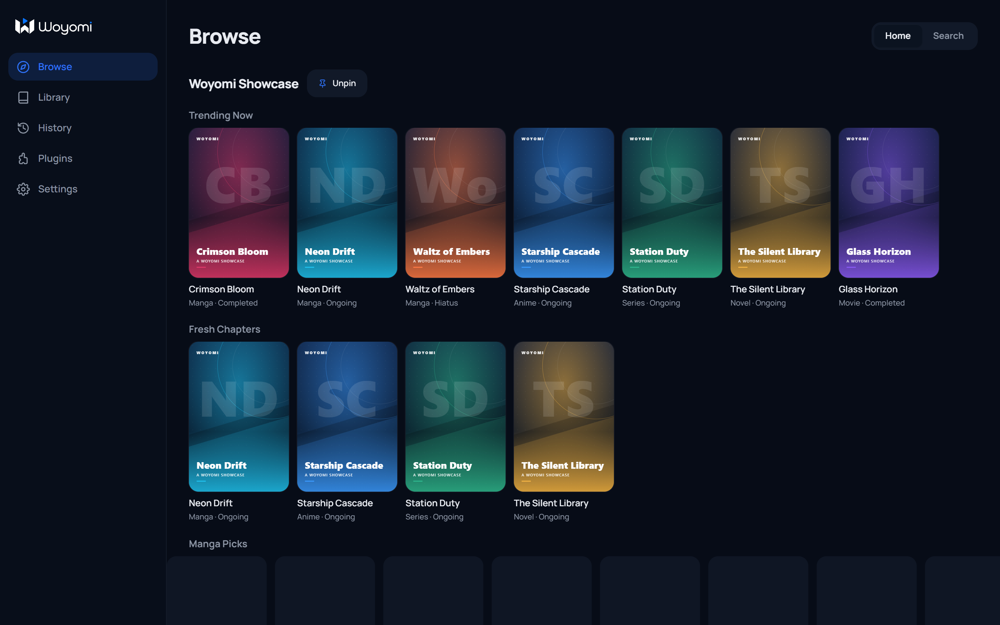
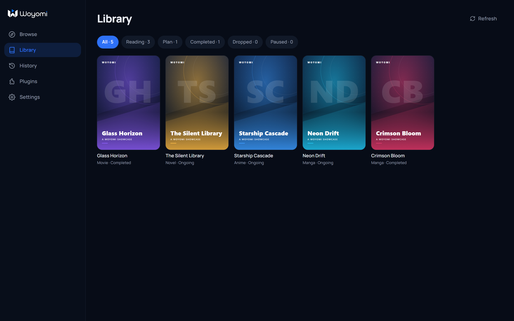
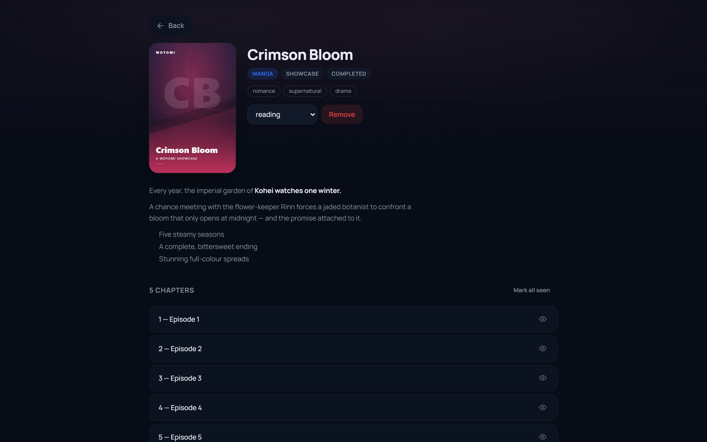
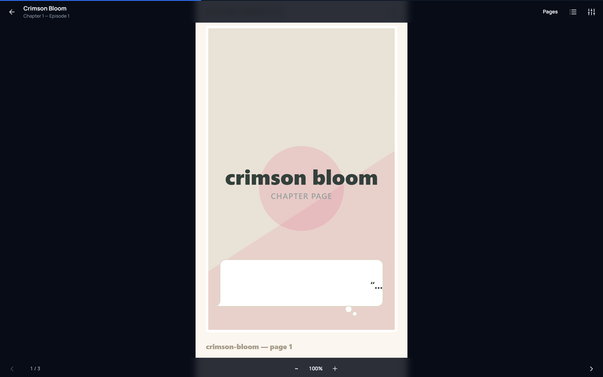
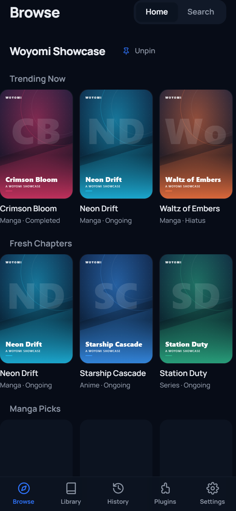
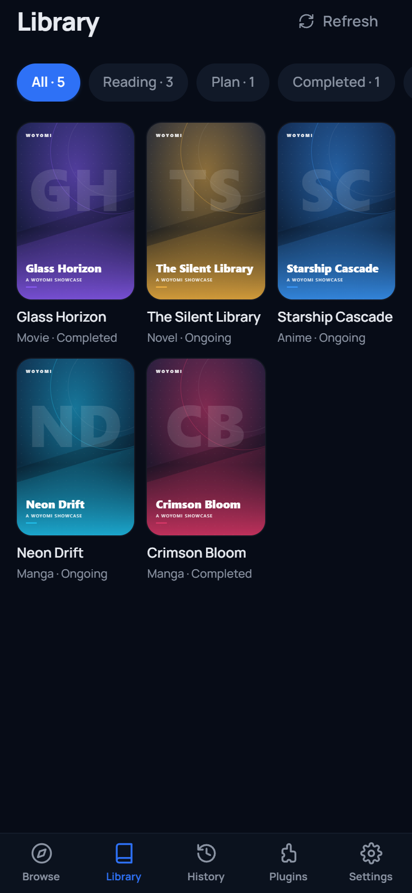

# woyomi

<p align="center">
  
</p>

<p align="center">
  <strong>Your library. Every format. One calm, beautiful home.</strong><br />
  A multi-source media reader and player for manga, anime, novels, movies, and series.
</p>

<p align="center">
  <a href="https://woyomi.rgw.app">Project site</a> ·
  <a href="#getting-started">Run locally</a> ·
  <a href="#building-plugins">Build a plugin</a>
</p>

<p align="center">
  
  
  
  
</p>

<p align="center">
  
</p>

## The personal streaming shelf

woyomi brings discovery, tracking, reading, watching, and offline access into one focused space. Install the sources you trust, build a library that feels like yours, and pick up exactly where you left off.

It is inspired by the thoughtful library workflows of [Aniyomi](https://github.com/aniyomiorg/aniyomi) and [Mihon](https://github.com/mihonapp/mihon), rebuilt as a modern **Tauri 2 desktop and Android app** with a modular TypeScript plugin system.

> woyomi ships with zero bundled sources by design. Sources are installed from external plugin repositories, keeping the app lightweight, extensible, and independent from any catalogue.

## Made for long sessions

| Discover | Read | Watch |
| --- | --- | --- |
| Search across every installed source, pin home rails, and browse by format. | Paged or continuous manga reading, plus a focused text reader for novels. | HLS and MP4 playback with episode, season, and progress tracking. |

| Keep your place | Take it offline | Keep it yours |
| --- | --- | --- |
| Library statuses, chapter and episode history, and automatic progress tracking. | Native downloads for manga pages, novel text, and direct MP4 assets. | Local-first storage, optional sync, and a plugin sandbox for safer extensions. |

## See it in action

### Desktop experience

<p align="center">
  
  
</p>

<p align="center">
  
  
</p>

<hr />

### Designed for mobile too

The same focused experience adapts to smaller screens with compact rails, touch-friendly controls, and bottom navigation built for one-handed use.

<p align="center">
  
  
</p>

## Why the plugin model matters

Every source is an independent TypeScript module. woyomi owns the product experience, storage, engine, transport, and sandbox; plugins own source-specific discovery and extraction.

- **One content model:** manga, anime, novels, movies, and series share the same library and progress workflows.
- **Transport-agnostic sources:** plugins use an injected `SourceContext`, not a global `fetch`.
- **Remote installation:** plugin repositories can live on any static host and are managed from the Plugins screen.
- **Integrity checks:** bundles are SHA-256 verified and gated by the runtime `apiVersion`.
- **Worker isolation:** each plugin runs inside its own Web Worker and talks to the host through a message bridge.

## Architecture

```text
apps/app                 React 18 + Vite UI and Tauri 2 Rust shell
apps/server              optional scrape proxy, sync service, and plugin repo
packages/core             plugin API, engine, stores, protocol, and sandbox
packages/plugin-builder   plugin bundler, manifest validator, and repo indexer
scripts/smoke.mjs         offline end-to-end plugin pipeline test
```

## Getting started

### Download a release

Native builds for **Windows, Linux, and Android** will be published on the [GitHub Releases page](https://github.com/JeanRGW/woyomi/releases). Download the package for your platform there when releases are available.

### Build from source

Requires **Node >= 22**, **pnpm 11.8.0**, and Rust 1.77+ for the native app.

```sh
pnpm install
pnpm build
pnpm test
pnpm typecheck
```

> Build first. Workspace packages consume each other's generated `dist/` outputs, so `pnpm build` comes before the app, smoke test, and release commands.

### Run the native app

```sh
pnpm --filter @woyomi/app tauri dev
pnpm --filter @woyomi/app tauri build
```

For Android, initialize the platform with `cargo tauri android init`, then use `cargo tauri android dev`. A physical device must reach the Vite server over your LAN, or through `adb reverse tcp:1420 tcp:1420`.

### Browser mode

The same React UI runs without the native shell for fast iteration:

```sh
pnpm --filter @woyomi/app dev
# http://localhost:1420
```

Browser mode uses direct `fetch` for CORS-enabled sources or an optional self-hosted scrape proxy.

### Optional self-hosted backend

```sh
cd apps/server
SYNC_TOKEN=replace-with-a-long-random-token DATA_DIR=./data PORT=8787 pnpm dev
curl http://localhost:8787/health
```

The server provides library sync, a plugin repository at `/repo`, and an opt-in `/api/scrape` proxy. The proxy is disabled by default and can be enabled with `SCRAPE_ENABLED=true` and optionally protected with `SCRAPE_TOKEN`.

## Building plugins

Create a package with `package.json` and `src/index.ts`, implement a `Source`, and register it with `__media_plugin_register`.

```sh
pnpm --filter @woyomi/plugin-builder exec node dist/cli.js <my-plugin> <my-plugin>/dist
pnpm --filter @woyomi/plugin-builder exec node dist/gen-repo.js <my-plugin>/dist
```

A plugin repository contains:

```text
index.json              repository metadata and artifact checksums
<id>.plugin.js          self-contained IIFE bundle
<id>.plugin.json        sidecar manifest
```

The unified source contract covers search, metadata, chapters or episodes, reader content, and optional video streams:

```ts
interface Source {
  id: string
  name: string
  mediaTypes: MediaType[]
  search(ctx, query, page): Promise<SearchResults>
  getMedia(ctx, id): Promise<Media>
  getEpisodes(ctx, mediaId): Promise<Episode[]>
  getChapterContent(ctx, mediaId, episodeId): Promise<ChapterContent>
  getStreams?(ctx, media, episode): Promise<StreamSource[]>
}
```

Plugins never call global `fetch`. They receive `ctx.fetch`, `ctx.cache`, and `ctx.preferences`; an HTML `DOMParser` is injected for parsing. Native `mode: 'dom'` fetches can render JavaScript-heavy pages through the Tauri bridge, while browser mode relies on direct CORS or the optional proxy.

## Testing

```sh
pnpm test
pnpm smoke
```

Tests are offline and cover the core engine, registry, loader, stores, parsers, plugin builder, repository generation, and server API. The smoke test builds a fixture plugin and runs it through bundle, load, search, home, episode, stream, and repository-index flows.

## Current limits

- The app ships with no sources; users install them from plugin repositories.
- Native downloads are available on Tauri desktop and Android, not browser mode.
- Only direct MP4 assets are downloadable; HLS and DRM streams are not offline assets.
- DRM/Widevine is not supported.
- Linux WebKitGTK has incomplete MSE support for some HLS streams.
- `mode: 'dom'` rendering is available in the native app but unavailable in browser mode.
- Downloaded media is device-local and excluded from library sync and JSON export.

## License

Apache License 2.0. See [`LICENSE`](LICENSE).
